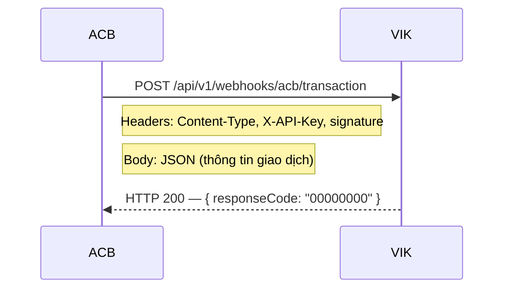

# Tài Liệu Tích Hợp Webhook Thông Báo Giao Dịch

> **Bên nhận:** VIK
> **Bên gửi:** ACB
> **Phiên bản:** 1.0 — Ngày 28/07/2026
> **Môi trường:** DEV (Sandbox)

---

## 1. Tổng quan

VIK cung cấp endpoint webhook để tiếp nhận thông báo biến động giao dịch (ghi nợ/ghi có) từ ACB. Khi phát sinh giao dịch trên tài khoản đã đăng ký, ACB gọi HTTP POST đến endpoint của VIK kèm thông tin giao dịch.



---

## 2. Trao đổi thông tin tích hợp

### 2.1. ACB cung cấp cho VIK

| #   | Thông tin                   | Mô tả                                                                        |
| --- | --------------------------- | ---------------------------------------------------------------------------- |
| 1   | **Bank Key** (`server_key`) | Khóa do ACB tạo, dùng trong công thức tính checksum                          |
| 2   | **Danh sách IP tĩnh**       | Danh sách IP server ACB sẽ gọi webhook (hỗ trợ CIDR, ví dụ `123.30.82.0/24`) |
| 3   | **Client ID**               | Mã định danh ACB cấp cho VIK                                                 |
| 4   | **Thuật toán checksum**     | Thuật toán hash sử dụng (mặc định: `SHA256`)                                 |

### 2.2. VIK cung cấp cho ACB

| #   | Thông tin                     | Giá trị DEV                                                        |
| --- | ----------------------------- | ------------------------------------------------------------------ |
| 1   | **Webhook URL**               | `https://dev.final.vn/api/v1/webhooks/acb/transaction`             |
| 2   | **API Key**                   | `8CGtMY3w9RV3plQMM1o76H1p85Qlr6WQLTZTLyVEtCKXLxdFPXtzpPZhd8U3mbpM` |
| 3   | **Secret Key** (`secret_key`) | `rX8Qm2Lk9VnP4zTfHs7JcW5yBaE1uNd6GpKv3ZxR8qMi2FsYwL0hCnUj9eAt5Db7` |

---

## 3. Xác thực

### 3.1. API Key

ACB truyền API Key trong header `X-API-Key` của mỗi request:

```
X-API-Key: <api_key_do_VIK_cung_cap>
```

### 3.2. Checksum (Chữ ký số)

Mỗi request phải kèm giá trị checksum trong header `signature` để VIK xác minh tính toàn vẹn dữ liệu.

**Công thức:**

```
signature = SHA256( RequestBody + SecretKey + BankKey )
```

| Thành phần    | Nguồn                                                        |
| ------------- | ------------------------------------------------------------ |
| `RequestBody` | Nội dung JSON body nguyên bản (raw string, không format lại) |
| `SecretKey`   | VIK cung cấp cho ACB (mục 2.2)                               |
| `BankKey`     | ACB cung cấp cho VIK (mục 2.1)                               |

**Ví dụ tính checksum:**

```
Body    = {"masterMeta":{"clientId":"uuid-001",...},"requests":[...]}
Secret  = my_secret_key
BankKey = my_bank_key

Input   = {"masterMeta":{"clientId":"uuid-001",...},"requests":[...]}my_secret_keymy_bank_key

signature = SHA256(Input) → "a1b2c3d4e5f6..." (64 ký tự hex, lowercase)
```

> [!IMPORTANT]
>
> - Nối trực tiếp 3 chuỗi **không có** dấu phân cách.
> - `RequestBody` phải là chuỗi JSON nguyên bản (đúng byte gửi đi), không được parse rồi stringify lại.
> - Kết quả checksum là chuỗi hex **lowercase**.

---

## 4. API Specification

### 4.1. Endpoint

| Thuộc tính       | Giá trị                                                |
| ---------------- | ------------------------------------------------------ |
| **URL (DEV)**    | `https://dev.final.vn/api/v1/webhooks/acb/transaction` |
| **Method**       | `POST`                                                 |
| **Content-Type** | `application/json`                                     |

### 4.2. Headers bắt buộc

| Header         | Giá trị            | Mô tả                         |
| -------------- | ------------------ | ----------------------------- |
| `Content-Type` | `application/json` | Bắt buộc                      |
| `X-API-Key`    | `<api_key>`        | API Key do VIK cung cấp       |
| `signature`    | `<checksum_hex>`   | Checksum SHA256 (xem mục 3.2) |

### 4.3. Request Body

```json
{
  "masterMeta": {
    "clientId": "vik-client-uuid-001",
    "clientRequestId": "550e8400-e29b-41d4-a716-446655440000",
    "checksum": "a1b2c3d4..."
  },
  "requests": [
    {
      "requestMeta": {
        "requestType": "NOTIFICATION",
        "requestCode": "TRANSACTION_UPDATE"
      },
      "requestParams": {
        "transactions": [
          {
            "transactionStatus": "COMPLETED",
            "transactionChannel": "MAPP",
            "transactionCode": "8179",
            "accountNumber": "68686868",
            "transactionDate": "2026-07-28T10:30:00.000Z",
            "effectiveDate": "2026-07-27T17:00:00.000Z",
            "debitOrCredit": "credit",
            "virtualAccountInfo": null,
            "virtualAccount": null,
            "referenceNumber": null,
            "partnerCustomerCode": null,
            "partnerCustomerName": null,
            "partnerCustomerType": null,
            "amount": 500000,
            "transactionEntityAttribute": {
              "traceNumber": "FT22262001",
              "beneficiaryName": "VIK COMPANY",
              "beneficiaryAccountNumber": "68686868",
              "receiverBankName": "ACB",
              "remitterName": "NGUYEN VAN A",
              "remitterAccountNumber": "123456789",
              "issuerBankName": "VIETCOMBANK"
            },
            "transactionContent": "THANH TOAN DON HANG VIK001"
          }
        ],
        "pagination": null
      }
    }
  ]
}
```

### 4.4. Mô tả các trường

#### `masterMeta`

| Trường            | Kiểu          | Bắt buộc | Mô tả                                                 |
| ----------------- | ------------- | -------- | ----------------------------------------------------- |
| `clientId`        | string        | ✅       | Mã định danh ACB cấp cho VIK                          |
| `clientRequestId` | string (UUID) | ✅       | Mã duy nhất cho mỗi request — dùng để chống trùng lặp |
| `checksum`        | string        | ✅       | Hash kiểm tra tính chính xác                          |

#### `requestMeta`

| Trường        | Giá trị hợp lệ        | Bắt buộc | Mô tả                         |
| ------------- | --------------------- | -------- | ----------------------------- |
| `requestType` | `NOTIFICATION`        | ✅       | Cố định                       |
| `requestCode` | `TRANSACTION_UPDATE`  | ✅       | Thông báo giao dịch tức thì   |
|               | `TRANSACTION_HISTORY` | ✅       | Thông báo giao dịch cuối ngày |

#### `transactions[]`

| Trường                 | Kiểu              | Bắt buộc | Mô tả                                                 |
| ---------------------- | ----------------- | -------- | ----------------------------------------------------- |
| `transactionStatus`    | string            | ✅       | `COMPLETED` — Thành công / `ERRORCORRECTED` — Hủy/đảo |
| `transactionChannel`   | string            | ✅       | Kênh GD (xem bảng bên dưới)                           |
| `transactionCode`      | string \| number  | ✅       | Mã giao dịch do ACB sinh                              |
| `accountNumber`        | string \| number  | ✅       | Số tài khoản nhận thông báo                           |
| `transactionDate`      | string (ISO 8601) | ✅       | Thời gian giao dịch                                   |
| `effectiveDate`        | string (ISO 8601) | ❌       | Thời gian hiệu lực                                    |
| `debitOrCredit`        | string            | ✅       | `credit` — Tiền vào / `debit` — Tiền ra               |
| `amount`               | number (≥ 0)      | ✅       | Số tiền (VND)                                         |
| `transactionContent`   | string            | ❌       | Nội dung chuyển khoản                                 |
| `virtualAccountInfo`   | object            | ❌       | Thông tin tài khoản ảo                                |
| `virtualAccount`       | string            | ❌       | Số tài khoản ảo                                       |
| `referenceNumber`      | string            | ❌       | Mã tham chiếu                                         |
| `partnerCustomerCode`  | string            | ❌       | Mã khách hàng trên hệ thống đối tác                   |
| `partnerCustomerName`  | string            | ❌       | Tên khách hàng                                        |
| `partnerCustomerType`  | string            | ❌       | Phân loại: `KHCN`, `KHDN`, `ORG`                      |
| `custom1` – `custom10` | string            | ❌       | Trường dữ liệu mở rộng                                |

#### `transactionEntityAttribute`

| Trường                     | Kiểu   | Mô tả                     |
| -------------------------- | ------ | ------------------------- |
| `traceNumber`              | string | Mã tra soát giao dịch     |
| `beneficiaryName`          | string | Tên người thụ hưởng       |
| `beneficiaryAccountNumber` | string | Số TK người thụ hưởng     |
| `receiverBankName`         | string | Tên ngân hàng thụ hưởng   |
| `remitterName`             | string | Tên người chuyển tiền     |
| `remitterAccountNumber`    | string | Số TK người chuyển tiền   |
| `issuerBankName`           | string | Tên ngân hàng chuyển tiền |

#### Danh sách `transactionChannel`

| Mã     | Mô tả          | Mã     | Mô tả            |
| ------ | -------------- | ------ | ---------------- |
| `MAPP` | Mobile App     | `IBFT` | Internet Banking |
| `ATM`  | ATM            | `API`  | API              |
| `WWW`  | Web            | `SMS`  | SMS Banking      |
| `BAT`  | Batch          | `VRU`  | VRU              |
| `ONLI` | Online         | `ACH`  | ACH              |
| `FSC`  | FSC            | `CCM`  | CCM              |
| `MG`   | MG             | `SECU` | Securities       |
| `ACHS` | ACH Settlement | `CCAT` | CCAT             |
| `AAP`  | AAP            | `CLMS` | Claims           |
| `REMI` | Remittance     | `TB`   | TB               |
| `SOBA` | SOBA           | `BIZ`  | Business         |

---

## 5. Response Format

### 5.1. Thành công — HTTP 200

```json
{
  "timestamp": "2026-07-28T10:30:05.123Z",
  "responseCode": "00000000",
  "message": "Success",
  "responseBody": {
    "referenceCode": "550e8400-e29b-41d4-a716-446655440000",
    "index": 1
  }
}
```

| Trường          | Mô tả                                        |
| --------------- | -------------------------------------------- |
| `timestamp`     | Thời điểm VIK xử lý (ISO 8601)               |
| `responseCode`  | `00000000` = thành công                      |
| `referenceCode` | Trả lại giá trị `clientRequestId` từ request |
| `index`         | Số lượng giao dịch đã tiếp nhận              |

### 5.2. Lỗi — HTTP 4xx

```json
{
  "timestamp": "2026-07-28T10:30:05.123Z",
  "responseCode": "40100001",
  "message": "Invalid or missing X-API-Key",
  "responseBody": null
}
```

### 5.3. Bảng mã lỗi

| HTTP Status | Response Code | Nguyên nhân                                      | Xử lý đề xuất                               |
| ----------- | ------------- | ------------------------------------------------ | ------------------------------------------- |
| `200`       | `00000000`    | Thành công                                       | —                                           |
| `400`       | `40000001`    | Payload không hợp lệ (thiếu trường, sai format)  | Kiểm tra lại cấu trúc JSON                  |
| `401`       | `40100001`    | Sai hoặc thiếu `X-API-Key`                       | Kiểm tra lại API Key                        |
| `401`       | `40100002`    | Thiếu header `signature`                         | Thêm header checksum                        |
| `401`       | `40100003`    | Checksum không khớp                              | Kiểm tra lại công thức tính checksum        |
| `403`       | `40300001`    | IP không được phép                               | Liên hệ VIK để bổ sung IP                   |
| `403`       | `40300002`    | IP bị tạm khóa (quá nhiều lần xác thực thất bại) | Chờ 30 phút hoặc liên hệ VIK                |
| `415`       | `41500001`    | Content-Type không phải `application/json`       | Đặt header `Content-Type: application/json` |
| `429`       | `42900001`    | Vượt quá giới hạn request                        | Giảm tần suất gọi, thử lại sau              |

---

## 6. Quy tắc quan trọng

### 6.1. Idempotency (Chống trùng lặp)

- Mỗi `clientRequestId` chỉ được xử lý **một lần duy nhất**.
- Nếu ACB gửi lại request với cùng `clientRequestId` (ví dụ: do timeout hoặc retry), VIK sẽ trả về `200 OK` mà **không xử lý lại** giao dịch.
- `clientRequestId` phải là UUID duy nhất cho mỗi request.

### 6.2. Rate Limit

| Giới hạn              | Giá trị                          |
| --------------------- | -------------------------------- |
| Số request tối đa     | **300 request / phút**           |
| Response khi vượt quá | HTTP `429` — `Too Many Requests` |

### 6.3. IP Whitelist

- VIK chỉ chấp nhận request từ các IP đã đăng ký trước.
- Nếu ACB thay đổi IP server, vui lòng thông báo trước để VIK cập nhật.
- Hỗ trợ cả IP đơn lẻ và CIDR notation (ví dụ: `123.30.82.0/24`).

---

> **Ghi chú:** Tài liệu này áp dụng cho môi trường **DEV (Sandbox)**. Khi chuyển sang môi trường **Production**, VIK sẽ cung cấp Webhook URL, API Key và Secret Key mới.
