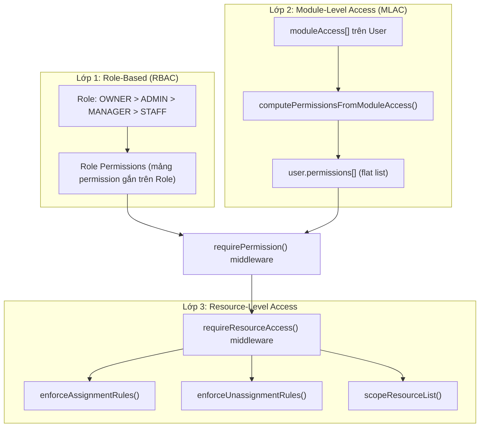

# Tổng quan Hệ thống Permission CRM — Review & Plan Rework

Báo cáo phân tích toàn bộ hệ thống phân quyền (RBAC + MLAC) hiện tại trong CRM BE & FE, trước khi thực hiện rework.

---

## 1. Kiến trúc tổng quan

Hệ thống hiện tại sử dụng **3 lớp phân quyền**:

### Luồng kiểm tra quyền (BE)

1. **`authenticateRequest()`** → Xác thực JWT, gắn `req.user`
2. **`requirePermission(PERMISSIONS.X)`** → Kiểm tra user có permission cần thiết (từ `user.permissions[]` hoặc `Role.permissions[]`)
3. **`requireResourceAccess()`** → Kiểm tra ownership, assignee, creator, manager subordinate
4. **`enforceAssignmentRules()`** → Kiểm tra quyền gán/bỏ gán người phụ trách
5. **`scopeResourceList()`** → Filter dữ liệu list trả về theo quyền hạn user

### Luồng kiểm tra quyền (FE)

1. **`isSidebarItemVisible()`** → Ẩn/hiện menu sidebar dựa trên `user.moduleAccess[]`
2. **`ProtectedRoute`** → Guard route dựa trên `hasModuleAccess()`
3. **`canAccessModule()` / `canPerformAction()`** → Ẩn/hiện nút, tab, section dựa trên module + action

---

## 2. Chi tiết các Resources & Permissions đã định nghĩa

### [rbac.js](file:///Users/truongtrang.nguyen/trangnt-workspace/freelancher/crm-app/crm-server/src/constants/rbac.js)

| Resource | CRUD Permissions | Special Permissions |
|----------|-----------------|---------------------|
| `users` | create, read, update, delete | restore, permanent_delete, manage |
| `customers` | create, read, update, delete | restore, permanent_delete, manage |
| `events` | create, read, update, delete | manage |
| `event_chains` | create, read, update, delete | close, manage |
| `tasks` | create, read, update, delete | manage |
| `task_chains` | create, read, update, delete | close, manage |
| `actions_cfg` | create, read, update, delete | manage |
| `organization` | read, update | manage |
| `roles` | create, read, update, delete | manage |
| `permissions` | read | manage |
| `metadata` | read | — |
| `functions` | create, read, update, delete | manage |
| `functional_groups` | create, read, update, delete | manage |
| `logs` | — | system_read, webhook_read, automation_read |
| `meta` | create, read, update, delete | manage |
| `leads_cfg` | — | manage |
| `leads` | create, read, update, delete | manage |
| `staffs` | create, read, update, delete | manage |
| `salaries` | create, read, update, delete | manage |
| `revenues` | create, read, update, delete | config, manage |
| `expenses` | create, read, update, delete | config, manage |
| `salary_configs` | create, read, update, delete | manage |
| `companies` | create, read, update, delete | manage |
| `finance` | read | — |

**Tổng cộng: 24 resources, ~80 permissions**

---

## 3. Permission theo Role (Hardcoded)

| Permission Group | STAFF | MANAGER | ADMIN | OWNER |
|---|:---:|:---:|:---:|:---:|
| **Customers** (CRUD) | ✅ | ✅ + restore + perm_delete | ✅ + manage | ✅ all |
| **Events** (CRUD) | ✅ | ✅ | ✅ + manage | ✅ all |
| **Event Chains** (CRUD + close) | ✅ | ✅ | ✅ + manage | ✅ all |
| **Tasks** (CRUD) | ✅ | ✅ | ✅ + manage | ✅ all |
| **Task Chains** (CRUD + close) | ✅ | ✅ | ✅ + manage | ✅ all |
| **Leads** (CRUD) | ✅ | ✅ | ✅ + manage | ✅ all |
| **Meta** (CRUD) | ✅ | ✅ | ✅ + manage | ✅ all |
| **Users** (CRUD + restore + perm_delete) | ❌ | ✅ | ✅ + manage | ✅ all |
| **Organization** (R/U) | ❌ | ✅ + manage | ✅ + manage | ✅ all |
| **Actions Config** (CRUD) | read only | ✅ create + update | ✅ + manage | ✅ all |
| **Functions** (CRUD) | read only | ✅ | ✅ + manage | ✅ all |
| **Functional Groups** (CRUD) | read only | ✅ | ✅ + manage | ✅ all |
| **Roles/Permissions** | ❌ | ❌ | read only | ✅ all |
| **Logs** (system/webhook/automation) | ❌ | ❌ | ✅ read | ✅ all |
| **Leads Config** | ❌ | ❌ | ✅ manage | ✅ all |
| **Staffs** (CRUD) | ❌ | ✅ | ✅ + manage | ✅ all |
| **Salaries** (CRUD) | ❌ | ✅ | ✅ + manage | ✅ all |
| **Revenues** (CRUD + config) | ❌ | ✅ | ✅ + manage | ✅ all |
| **Expenses** (CRUD + config) | ❌ | ✅ | ✅ + manage | ✅ all |
| **Salary Configs** (CRUD) | ❌ | ✅ | ✅ + manage | ✅ all |
| **Companies** (CRUD) | ❌ | ✅ | ✅ + manage | ✅ all |
| **Finance Dashboard** | ❌ | ✅ read | ✅ read | ✅ all |

---

## 4. API Routes → Permission Mapping (chi tiết từng endpoint)

### 4.1 Auth ([auth.js](file:///Users/truongtrang.nguyen/trangnt-workspace/freelancher/crm-app/crm-server/src/routes/v1/auth.js))

| Method | Endpoint | Permission | Resource Access | Notes |
|--------|----------|------------|-----------------|-------|
| POST | `/auth/login` | 🔓 Public | — | |
| POST | `/auth/refresh` | 🔓 Public | — | |
| POST | `/auth/forgot-password` | 🔓 Public | — | |
| POST | `/auth/reset-password` | 🔓 Public | — | |
| POST | `/auth/logout` | 🔓 Public | — | |
| GET | `/auth/me` | 🔒 Auth only | — | |
| PUT | `/auth/me` | 🔒 Auth only | — | |
| POST | `/auth/change-password` | 🔒 Auth only | — | |
| POST | `/auth/register` | `users_create` | — | |

### 4.2 Users ([users.js](file:///Users/truongtrang.nguyen/trangnt-workspace/freelancher/crm-app/crm-server/src/routes/v1/users.js))

| Method | Endpoint | Permission | Resource Access | Notes |
|--------|----------|------------|-----------------|-------|
| GET | `/users/org-options` | 🔒 Auth only | — | ⚠️ Không có permission check |
| GET | `/users` | `users_read` | scopeAssignmentList | Manager chỉ thấy subordinate |
| POST | `/users` | `users_create` | — | |
| PUT | `/users/:id` | `users_update` | userResourceAccess | |
| DELETE | `/users/:id` | `users_delete` | userResourceAccess | |
| PUT | `/users/:id/restore` | Role: OWNER/ADMIN + `users_restore` | — | |
| DELETE | `/users/:id/permanent` | Role: OWNER/ADMIN + `users_permanent_delete` | — | |

### 4.3 Customers ([customers.js](file:///Users/truongtrang.nguyen/trangnt-workspace/freelancher/crm-app/crm-server/src/routes/v1/customers.js))

| Method | Endpoint | Permission | Resource Access | Notes |
|--------|----------|------------|-----------------|-------|
| GET | `/customers` | `customers_read` | — | ⚠️ Không có scopeResourceList |
| GET | `/customers/:id` | `customers_read` | customerScopeList | |
| POST | `/customers` | `customers_create` | — | |
| PUT | `/customers/:id` | `customers_update` | customerResourceAccess | |
| DELETE | `/customers/:id` | `customers_delete` | customerResourceAccess | |
| PUT | `/customers/:id/restore` | Role: OWNER/ADMIN + `customers_restore` | — | |
| DELETE | `/customers/:id/permanent` | Role: OWNER/ADMIN + `customers_permanent_delete` | — | |

### 4.4 Events ([events.js](file:///Users/truongtrang.nguyen/trangnt-workspace/freelancher/crm-app/crm-server/src/routes/v1/events.js))

| Method | Endpoint | Permission | Resource Access | Notes |
|--------|----------|------------|-----------------|-------|
| GET | `/events` | `events_read` | eventScopeList | |
| GET | `/events/stats` | `events_read` | eventScopeList | |
| GET | `/events/:id` | `events_read` | eventResourceAccess (allowUnassigned) | |
| POST | `/events` | `events_create` | eventAssignmentRules | |
| PUT | `/events/:id` | `events_update` | eventResourceAccess + assignment + unassignment | |
| POST | `/events/:id/timeline` | `events_update` | eventResourceAccess | |
| DELETE | `/events/:id/timeline/:tid` | `events_update` | eventResourceAccess | |
| DELETE | `/events/:id` | `events_delete` | eventResourceAccess | |
| POST | `/events/:id/archive` | Role: OWNER/ADMIN + `events_update` | eventResourceAccess | |
| POST | `/events/:id/unarchive` | Role: OWNER/ADMIN + `events_update` | eventResourceAccess | |
| POST | `/events/:id/sync-customer` | `events_update` | eventResourceAccess | |
| POST | `/events/:id/self-assign` | `events_update` | eventResourceAccess (allowUnassigned) | |
| DELETE | `/events/:id/assignee` | `events_update` | eventResourceAccess + unassignment | |

### 4.5 Event Chains ([eventChains.js](file:///Users/truongtrang.nguyen/trangnt-workspace/freelancher/crm-app/crm-server/src/routes/v1/eventChains.js))

| Method | Endpoint | Permission | Resource Access |
|--------|----------|------------|-----------------|
| GET | `/events/:eid/chains` | `event_chains_read` | — |
| POST | `/events/:eid/chains` | `event_chains_create` | eventResourceAccess |
| POST | `/:chainId/steps` | `event_chains_update` | eventResourceAccess |
| PUT | `/:chainId/steps/current` | `event_chains_update` | eventResourceAccess |
| PATCH | `/:chainId/steps/current/delay` | `event_chains_update` | eventResourceAccess |
| PATCH | `/:chainId/steps/:stepOrder/note` | `event_chains_update` | eventResourceAccess |
| PUT | `/:chainId/steps/:stepOrder/branches` | `event_chains_update` | eventResourceAccess |
| DELETE | `/:chainId/steps/:stepOrder/branches/:resultId` | `event_chains_update` | eventResourceAccess |
| POST | `/:chainId/steps/current/execute-block-automation` | `event_chains_update` | eventResourceAccess |
| PUT | `/:chainId/close` | `event_chains_close` | eventResourceAccess |
| DELETE | `/:chainId` | `event_chains_delete` | eventResourceAccess |

### 4.6 Tasks ([tasks.js](file:///Users/truongtrang.nguyen/trangnt-workspace/freelancher/crm-app/crm-server/src/routes/v1/tasks.js))

| Method | Endpoint | Permission | Resource Access |
|--------|----------|------------|-----------------|
| GET | `/tasks` | `tasks_read` | taskScopeList |
| POST | `/tasks` | `tasks_create` | taskAssignmentRules |
| GET | `/tasks/search-events` | `tasks_read` + `events_read` | — |
| GET | `/tasks/search-leads` | `tasks_read` + `leads_read` | — |
| GET | `/tasks/by-event/:eventId` | `tasks_read` + `events_read` | — |
| GET | `/tasks/by-lead/:leadId` | `tasks_read` + `leads_read` | — |
| GET | `/tasks/:id` | `tasks_read` | taskResourceAccess (allowUnassigned) |
| PUT | `/tasks/:id` | `tasks_update` | taskResourceAccess + assignment + unassignment |
| PUT | `/tasks/:id/close` | `tasks_update` | taskResourceAccess |
| PUT | `/tasks/:id/archive` | Role: OWNER/ADMIN + `tasks_update` | — |
| PUT | `/tasks/:id/unarchive` | Role: OWNER/ADMIN + `tasks_update` | — |
| DELETE | `/tasks/:id` | `tasks_delete` | taskResourceAccess |
| POST | `/tasks/:id/link-event` | `tasks_update` | taskResourceAccess |
| DELETE | `/tasks/:id/unlink-event/:eventId` | `tasks_update` | taskResourceAccess |
| POST | `/tasks/:id/link-lead` | `tasks_update` | taskResourceAccess |
| DELETE | `/tasks/:id/unlink-lead/:leadId` | `tasks_update` | taskResourceAccess |

### 4.7 Task Chains ([taskChains.js](file:///Users/truongtrang.nguyen/trangnt-workspace/freelancher/crm-app/crm-server/src/routes/v1/taskChains.js))

| Method | Endpoint | Permission | Resource Access |
|--------|----------|------------|-----------------|
| GET | `/tasks/:taskId/chains` | `task_chains_read` | — |
| POST | `/tasks/:taskId/chains` | `task_chains_create` | taskResourceAccess |
| POST | `/:chainId/steps` | `task_chains_update` | taskResourceAccess |
| PUT | `/:chainId/steps/current` | `task_chains_update` | taskResourceAccess |
| PATCH | `/:chainId/steps/current/delay` | `task_chains_update` | taskResourceAccess |
| PATCH | `/:chainId/steps/:stepOrder/note` | `task_chains_update` | taskResourceAccess |
| PUT | `/:chainId/steps/:stepOrder/branches` | `task_chains_update` | taskResourceAccess |
| DELETE | `/:chainId/steps/:stepOrder/branches/:resultId` | `task_chains_update` | taskResourceAccess |
| PUT | `/:chainId/close` | `task_chains_close` | taskResourceAccess |
| POST | `/:chainId/execute-block-automation` | `task_chains_update` | taskResourceAccess |
| DELETE | `/:chainId` | `task_chains_delete` | taskResourceAccess |

### 4.8 Leads ([leads.js](file:///Users/truongtrang.nguyen/trangnt-workspace/freelancher/crm-app/crm-server/src/routes/v1/leads.js))

| Method | Endpoint | Permission | Resource Access |
|--------|----------|------------|-----------------|
| GET | `/leads` | `leads_read` | leadScopeList |
| GET | `/leads/stage-counts` | `leads_read` | leadScopeList |
| GET | `/leads/:id` | `leads_read` | leadResourceAccess (allowUnassigned) |
| POST | `/leads` | `leads_create` | leadAssignmentRules |
| PUT | `/leads/:id` | `leads_update` | leadResourceAccess + assignment + unassignment |
| POST | `/leads/:id/self-assign` | `leads_update` | leadAssignmentRules + leadResourceAccess (allowUnassigned) |
| POST | `/leads/:id/confirm-stage` | `leads_update` | leadResourceAccess |
| DELETE | `/leads/:id` | `leads_delete` | leadResourceAccess |
| POST | `/leads/:id/archive` | Role: OWNER/ADMIN + `leads_update` | — |
| POST | `/leads/:id/unarchive` | Role: OWNER/ADMIN + `leads_update` | — |
| POST | `/leads/:id/timeline` | `leads_update` | leadResourceAccess |
| POST | `/leads/:id/discussions` | `leads_read` | leadResourceAccess |
| GET | `/leads/:id/activity-logs` | `leads_read` | leadResourceAccess (allowUnassigned) |

### 4.9 Lead Config ([leadConfig.js](file:///Users/truongtrang.nguyen/trangnt-workspace/freelancher/crm-app/crm-server/src/routes/v1/leadConfig.js))

| Method | Endpoint | Permission |
|--------|----------|------------|
| GET | `/lead-config/statuses` | `leads_read` |
| GET | `/lead-config/groups` | `leads_read` |
| POST | `/lead-config/statuses` | `leads_cfg_manage` |
| PUT | `/lead-config/statuses/:id` | `leads_cfg_manage` |
| DELETE | `/lead-config/statuses/:id` | `leads_cfg_manage` |
| POST | `/lead-config/groups` | `leads_cfg_manage` |
| PUT | `/lead-config/groups/:id` | `leads_cfg_manage` |
| DELETE | `/lead-config/groups/:id` | `leads_cfg_manage` |

### 4.10 Meta ([meta.js](file:///Users/truongtrang.nguyen/trangnt-workspace/freelancher/crm-app/crm-server/src/routes/v1/meta.js))

| Method | Endpoint | Permission | Resource Access |
|--------|----------|------------|-----------------|
| GET | `/meta/config` | `meta_read` | — |
| POST | `/meta/config` | `meta_manage` | — |
| PUT | `/meta/config/:id` | `meta_manage` | — |
| DELETE | `/meta/config/:id` | `meta_manage` | — |
| GET | `/meta/programs` | `meta_read` | metaScopeList |
| GET | `/meta/programs/:id` | `meta_read` | metaProgramAccess (allowUnassigned) |
| POST | `/meta/programs` | `meta_create` | metaAssignmentRules |
| PUT | `/meta/programs/:id` | `meta_update` | metaProgramAccess + assignment + unassignment |
| POST | `/meta/programs/:id/self-assign` | `meta_update` | metaProgramAccess (allowUnassigned) |
| DELETE | `/meta/programs/:id` | `meta_delete` | metaProgramAccess |
| POST/PUT/DELETE | `/meta/programs/:id/milestones/...` | `meta_update` | metaProgramAccess |
| POST/PUT/DELETE | `/meta/programs/:id/tasks/...` | `meta_update` | metaProgramAccess |
| POST/DELETE | `/meta/programs/:id/attachments/...` | `meta_update` | metaProgramAccess |
| POST/DELETE | `/meta/programs/:id/comments/...` | `meta_update` | metaProgramAccess |

### 4.11 Action Config ([actionConfig.js](file:///Users/truongtrang.nguyen/trangnt-workspace/freelancher/crm-app/crm-server/src/routes/v1/actionConfig.js))

| Method | Endpoint | Permission |
|--------|----------|------------|
| GET | `/action-config/results` | `actions_cfg_read` |
| POST | `/action-config/results` | `actions_cfg_create` |
| PUT | `/action-config/results/:id` | `actions_cfg_update` |
| DELETE | `/action-config/results/:id` | `actions_cfg_delete` |
| GET/POST/PUT/DELETE | `/action-config/reasons` | Tương tự results |
| GET/POST/PUT/DELETE | `/action-config/actions` | Tương tự results |
| GET/POST/PUT/DELETE | `/action-config/chains` | Tương tự results |
| PUT | `/action-config/chains/:id/rule` | `actions_cfg_update` |
| GET | `/action-config/block-automations` | `actions_cfg_read` |
| GET | `/action-config/block-automations/:id` | `actions_cfg_read` |
| POST | `/action-config/block-automations` | `actions_cfg_manage` |
| PUT | `/action-config/block-automations/:id` | `actions_cfg_manage` OR `actions_cfg_create` (any) |
| DELETE | `/action-config/block-automations/:id` | `actions_cfg_manage` |
| GET | `/action-config/event-schema-fields` | `actions_cfg_read` |
| GET | `/action-config/lead-schema-fields` | `actions_cfg_read` |

### 4.12 Staff & Finance

| Route File | Endpoints | Permission Pattern |
|------------|-----------|-------------------|
| [staffs.js](file:///Users/truongtrang.nguyen/trangnt-workspace/freelancher/crm-app/crm-server/src/routes/v1/staffs.js) | CRUD `/staffs` | `staffs_{action}` |
| [salaries.js](file:///Users/truongtrang.nguyen/trangnt-workspace/freelancher/crm-app/crm-server/src/routes/v1/salaries.js) | GET, POST/generate, PUT/batch, POST/:id/pay | `salaries_{action}` |
| [salaryConfigs.js](file:///Users/truongtrang.nguyen/trangnt-workspace/freelancher/crm-app/crm-server/src/routes/v1/salaryConfigs.js) | POST `/salary-configs` | `salary_configs_manage` |
| [revenues.js](file:///Users/truongtrang.nguyen/trangnt-workspace/freelancher/crm-app/crm-server/src/routes/v1/revenues.js) | CRUD + categories + expected + stats | `revenues_{action}`, `revenues_config` |
| [expenses.js](file:///Users/truongtrang.nguyen/trangnt-workspace/freelancher/crm-app/crm-server/src/routes/v1/expenses.js) | CRUD + categories + expected + stats | `expenses_{action}`, `expenses_config` |
| [companies.js](file:///Users/truongtrang.nguyen/trangnt-workspace/freelancher/crm-app/crm-server/src/routes/v1/companies.js) | CRUD `/companies` | `companies_{action}` |
| [finance.js](file:///Users/truongtrang.nguyen/trangnt-workspace/freelancher/crm-app/crm-server/src/routes/v1/finance.js) | GET `/finance/dashboard` | `finance_read` |

### 4.13 Shared/Lookup APIs (auth only, no specific permission)

| Route File | Endpoints | Permission |
|------------|-----------|------------|
| [organization.js](file:///Users/truongtrang.nguyen/trangnt-workspace/freelancher/crm-app/crm-server/src/routes/v1/organization.js) | GET `/organization`, POST departments, POST groups | `organization_read` / `organization_update` |
| [metadata.js](file:///Users/truongtrang.nguyen/trangnt-workspace/freelancher/crm-app/crm-server/src/routes/v1/metadata.js) | GET `/metadata/*` | 🔒 Auth only, **no permission** |
| [functions.js](file:///Users/truongtrang.nguyen/trangnt-workspace/freelancher/crm-app/crm-server/src/routes/v1/functions.js) | GET/POST `/functions` | `functions_read` / `functions_create` |
| [functionalGroups.js](file:///Users/truongtrang.nguyen/trangnt-workspace/freelancher/crm-app/crm-server/src/routes/v1/functionalGroups.js) | CRUD `/functional-groups` | `functional_groups_{action}` |
| [funnels.js](file:///Users/truongtrang.nguyen/trangnt-workspace/freelancher/crm-app/crm-server/src/routes/v1/funnels.js) | CRUD `/funnels` + folders + groups | ⚠️ **Không có permission check** |
| [logs.js](file:///Users/truongtrang.nguyen/trangnt-workspace/freelancher/crm-app/crm-server/src/routes/v1/logs.js) | GET webhook/system/automation, POST retry | `logs_*_read`, Role: OWNER/ADMIN |
| [rbac.js](file:///Users/truongtrang.nguyen/trangnt-workspace/freelancher/crm-app/crm-server/src/routes/v1/rbac.js) | CRUD `/rbac/roles`, GET permissions | `roles_{action}` / `permissions_read` |
| [webhooks.js](file:///Users/truongtrang.nguyen/trangnt-workspace/freelancher/crm-app/crm-server/src/routes/v1/webhooks.js) | POST ingestion endpoints | 🔓 Webhook bearer token |
| [globalEventChains.js](file:///Users/truongtrang.nguyen/trangnt-workspace/freelancher/crm-app/crm-server/src/routes/v1/globalEventChains.js) | GET `/event-chains/queue` | `event_chains_read` + scopeResourceList |

---

## 5. Module-Level Access Control (MLAC) — Mapping

### [MODULE_DEFINITIONS](file:///Users/truongtrang.nguyen/trangnt-workspace/freelancher/crm-app/crm-server/src/constants/rbac.js#L355-L387)

| Module ID | Label | Type | Actions |
|-----------|-------|------|---------|
| `customers` | Khách hàng | root | — |
| `customers.biz` | Doanh nghiệp | sub | view, create, edit, delete, export |
| `customers.user` | Cá nhân | sub | view, create, edit, delete, export |
| `operations` | Quản lý | root | — |
| `operations.tasks` | Quản lý Tác vụ | sub | view, create, edit, delete |
| `operations.events` | Quản lý Sự kiện | sub | view, create, edit, delete, configure |
| `operations.leads` | Quản lý Lead | sub | view, create, edit, delete, configure |
| `meta` | Hợp tác Meta | root | — |
| `meta.program` | Chương trình | sub | view, create, edit, delete |
| `meta.config` | Cấu hình | sub | view, create, edit, delete |
| `staff` | Nhân viên | root | — |
| `staff.users` | Tài khoản | sub | view, create, edit, delete |
| `staff.organization` | Sơ đồ tổ chức | sub | view, create, edit |
| `staff.functions` | Chức năng | sub | view, create, edit, delete |
| `staff.functional_groups` | Khối chức năng | sub | view, create, edit, delete |
| `staff.companies` | Công ty | sub | view, create, edit, delete |
| `logs` | Logs Hệ thống | root | — |
| `logs.system` | System Logs | sub | view |
| `logs.webhook` | Webhook Logs | sub | view |
| `logs.blockautomation` | Block Automation Logs | sub | view |
| `finance` | Tài chính | root | — |
| `finance.dashboard` | Tổng quan | sub | view |
| `finance.revenue` | Doanh thu | sub | view, create, edit, delete, configure |
| `finance.expense` | Chi phí | sub | view, create, edit, delete, configure |
| `finance.salary` | Lương | sub | view, create, edit, delete, configure |
| `finance.salary_config` | Cấu hình lương | sub | view, create, edit, delete, configure |

### [MODULE_TO_PERMISSIONS_MAP](file:///Users/truongtrang.nguyen/trangnt-workspace/freelancher/crm-app/crm-server/src/constants/rbac.js#L389-L505) — Module Action → API Permissions

Khi user được cấu hình moduleAccess, `computePermissionsFromModuleAccess()` sẽ dịch từng module + action → flat permission list. Ví dụ:

- `operations.events` → `view` → `[events_read, event_chains_read, actions_cfg_read, users_read]`
- `finance.expense` → `configure` → `[expenses_config, expenses_manage]`

---

## 6. FE Permission Check

### Sidebar Visibility ([Layout.tsx](file:///Users/truongtrang.nguyen/trangnt-workspace/freelancher/crm-app/crm-client/src/components/Layout.tsx))

Sử dụng `SIDEBAR_MODULE_MAP` để map sidebar item → module IDs, rồi check `isSidebarItemVisible()`.

| Sidebar Item | Mapped Module IDs |
|---|---|
| `customers` | `['customers']` |
| `events` | `['operations', 'operations.events', 'operations.leads', 'operations.tasks']` |
| `meta` | `['meta']` |
| `finance` | `['finance', 'finance.revenue', 'finance.expense', 'finance.salary', 'finance.salary_config']` |
| `staff` | `['staff']` |
| `logs` | `['logs']` |

### Route Protection ([App.tsx](file:///Users/truongtrang.nguyen/trangnt-workspace/freelancher/crm-app/crm-client/src/App.tsx))

Mỗi route được bọc bởi `<ProtectedRoute moduleIds={[...]}>`

### Component-Level Checks

Các component sử dụng `useModuleAccess()` hook:
- **CustomersPage**: `canAccessModule('customers.biz')`, `canAccessModule('customers.user')`
- **FinancePage**: `canAccessModule('finance.dashboard')`, `canAccessModule('finance.revenue')`, etc.
- **UserPage**: `canAccessModule('staff.users', 'view')`, `canAccessModule('staff.organization', 'view')`, etc.
- **LogsPage**: `canAccessModule('logs.system')`, `canAccessModule('logs.webhook')`, `canAccessModule('logs.blockautomation')`
- **MetaPage**: `canAccessModule('meta.config')`
- **CompaniesTab**: `canAccessModule('staff.companies', 'create/edit/delete')`

---

## 7. Các vấn đề & Inconsistencies phát hiện

> [!WARNING]
> ### Vấn đề nghiêm trọng

1. **Funnels API không có permission check** — [funnels.js](file:///Users/truongtrang.nguyen/trangnt-workspace/freelancher/crm-app/crm-server/src/routes/v1/funnels.js) — tất cả CRUD đều chỉ cần auth, không check permission.

2. **Metadata API không có permission check** — [metadata.js](file:///Users/truongtrang.nguyen/trangnt-workspace/freelancher/crm-app/crm-server/src/routes/v1/metadata.js) — mặc dù có `METADATA_READ` permission nhưng không ai dùng nó ở route.

3. **`/users/org-options` không có permission** — Endpoint này trả dữ liệu organizational nhưng không kiểm tra `users_read`.

> [!IMPORTANT]
> ### Inconsistencies

4. **Naming convention không nhất quán** — `USER_RESTORE` (thiếu `S`) vs `USERS_DELETE` (có `S`). Tương tự: `CUSTOMER_RESTORE` vs `CUSTOMERS_DELETE`.

5. **`finance.revenue` configure → `REVENUES_MANAGE`** nhưng **`finance.expense` configure → `[EXPENSES_CONFIG, EXPENSES_MANAGE]`** — không nhất quán giữa revenue và expense.

6. **STAFF có delete permission cho customers, events, leads, tasks** — Có thể quá rộng, Staff không nên xóa tài nguyên.

7. **Customers GET list không có scopeResourceList** — Customer list không filter theo creator/assignee cho STAFF/MANAGER (chỉ GET /:id mới có `customerScopeList`).

8. **`canAccessModule()` hook sử dụng `hasModuleAccess()` thay vì `hasModuleAction()`** — Khi gọi `canAccessModule('staff.users', 'view')`, thực tế nó đang check `hasModuleAccess` chứ không check action `view` cụ thể.

9. **FE `MODULE_DEFINITIONS` thiếu `staff.functional_groups`** so với BE — BE có nhưng FE [constants.ts:L88](file:///Users/truongtrang.nguyen/trangnt-workspace/freelancher/crm-app/crm-client/src/constants.ts#L88) không có.

10. **`ROLES_MANAGE` permission tồn tại** nhưng không có trong `ROLE_DEFINITIONS` của bất kỳ role nào (ngoại trừ OWNER qua `Object.values(PERMISSIONS)`). ADMIN chỉ có `ROLES_READ`.

---

## 8. Quyết định cần Review trước khi Rework

> [!IMPORTANT]
> Các quyết định sau đây cần bạn xác nhận trước khi tôi lên plan rework chi tiết:

### Q1: Phạm vi rework
Bạn muốn rework ở mức nào?
- **A)** Chỉ fix các inconsistencies & bugs trên (giữ nguyên kiến trúc 3 lớp)
- **B)** Rework lại toàn bộ permission mapping, đổi tên cho nhất quán, bổ sung thiếu
- **C)** Thiết kế lại kiến trúc RBAC mới (loại bỏ hardcoded role → full dynamic)

### Q2: STAFF nên có quyền DELETE không?
Hiện tại STAFF có thể delete customers, events, leads, tasks. Có nên hạn chế lại không?

### Q3: Funnels nên có permission riêng không?
Hiện tại Funnels API không có permission check. Bạn muốn:
- **A)** Thêm resource `funnels` vào RBAC
- **B)** Gắn quyền funnels vào `leads_cfg_manage` (vì funnel liên quan tới lead pipeline)
- **C)** Giữ nguyên (auth only)

### Q4: Hướng xử lý `canAccessModule()` vs `canPerformAction()` trên FE?
Hiện tại FE sử dụng `canAccessModule()` nhưng truyền cả 2 params `(moduleId, action)` — thực tế function này là `hasModuleAccess()` không check action. Cần sửa lại call site hay sửa function?

---

## Verification Plan

### Automated Tests
- Viết integration test cho từng route, assert permission check 
- Test case cho mỗi role: OWNER, ADMIN, MANAGER, STAFF

### Manual Verification
- Test trên FE: sidebar ẩn/hiện, nút ẩn/hiện cho từng role
- Test API trực tiếp với token của từng role
