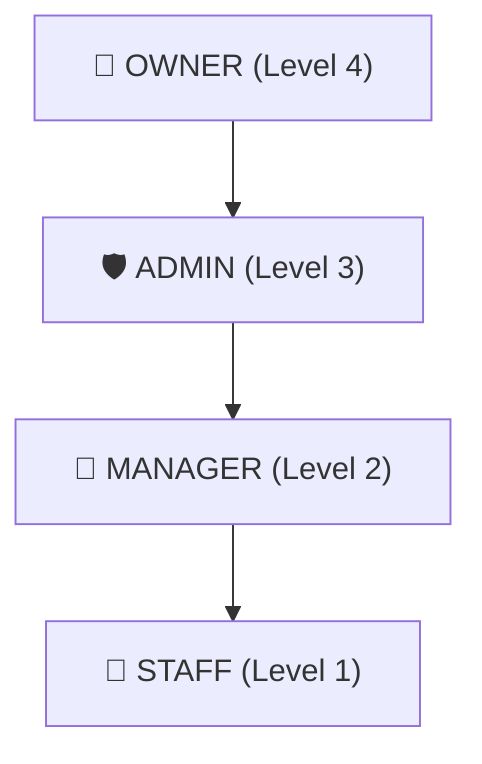

# 📋 Tài Liệu Phân Quyền RBAC — CRM System

> **Phiên bản:** 1.0 · **Cập nhật:** 2026-05-13
> **Nguồn:** [rbac.js](file:///Users/truongtrang.nguyen/trangnt-workspace/freelancher/crm-app/crm-server/src/constants/rbac.js) · [auth middleware](file:///Users/truongtrang.nguyen/trangnt-workspace/freelancher/crm-app/crm-server/src/middleware/auth.js)

---

## 1. Tổng Quan Vai Trò (Role Hierarchy)

| Vai trò     | Level | Mô tả               | Đặc điểm                                                                                     |
| ----------- | ----- | ------------------- | -------------------------------------------------------------------------------------------- |
| **OWNER**   | 4     | Chủ sở hữu hệ thống | Có **toàn bộ** quyền. Không ai có thể gán role OWNER cho người khác. Chỉ có duy nhất 1 OWNER |
| **ADMIN**   | 3     | Quản trị viên       | Có quyền `_manage` trên hầu hết module. Quản lý cấu hình hệ thống, xem logs                  |
| **MANAGER** | 2     | Quản lý nhóm        | Quản lý nhân viên **trong phạm vi phòng ban** của mình. Có thêm quyền tạo cấu hình action    |
| **STAFF**   | 1     | Nhân viên           | Quyền cơ bản: đọc, tạo, cập nhật trên các module nghiệp vụ chính                             |

> [!IMPORTANT]
> **Quy tắc `_manage` override:** Nếu role có quyền `resource_manage`, hệ thống tự động cấp phép cho **tất cả** hành động con (`_read`, `_create`, `_update`, `_delete`...) trên resource đó. Xem [getPermissionVariants](file:///Users/truongtrang.nguyen/trangnt-workspace/freelancher/crm-app/crm-server/src/utils/rbac.js#L5-L26).

---

## 2. Ma Trận Quyền Hạn Chi Tiết

### 2.1. 👥 Quản Lý Nhân Viên (`users`)

| Hành động           | Permission     | STAFF | MANAGER | ADMIN | OWNER |
| ------------------- | -------------- | :---: | :-----: | :---: | :---: |
| Xem danh sách       | `users_read`   |  ⚠️   |   ✅    |  ✅   |  ✅   |
| Tạo nhân viên       | `users_create` |  ❌   |   ✅    |  ✅   |  ✅   |
| Cập nhật nhân viên  | `users_update` |  ❌   |   ✅    |  ✅   |  ✅   |
| Xóa nhân viên       | `users_delete` |  ❌   |   ❌    |  ✅   |  ✅   |
| Khôi phục nhân viên | `users_delete` |  ❌   |   ❌    |  ✅   |  ✅   |
| Xóa vĩnh viễn       | `users_delete` |  ❌   |   ❌    |  ✅   |  ✅   |
| Xem org-options     | _(no perm)_    |  ✅   |   ✅    |  ✅   |  ✅   |
| Xem người đã xóa    | _(isDeleted)_  |  ❌   |   ❌    |  ✅   |  ✅   |

> [!NOTE]
>
> - ⚠️ **STAFF** được phép gọi API `GET /users` nhưng chỉ nhận **thông tin cơ bản** (id, name, avatar) — không thấy email, phone, department.
> - **MANAGER** chỉ thấy nhân viên **cùng phòng ban** (department scope filter trong `buildUserListQuery`).
> - **MANAGER** chỉ được tạo/sửa nhân viên role **STAFF** trong phạm vi phòng ban.
> - Không ai tự sửa được chính mình qua endpoint `/users/:id`.

### 2.2. 🏢 Khách Hàng (`customers`)

| Hành động        | Permission                   | STAFF | MANAGER | ADMIN | OWNER |
| ---------------- | ---------------------------- | :---: | :-----: | :---: | :---: |
| Xem danh sách    | `customers_read`             |  ✅   |   ✅    |  ✅   |  ✅   |
| Xem chi tiết     | `customers_read`             |  ✅   |   ✅    |  ✅   |  ✅   |
| Tạo mới          | `customers_create`           |  ✅   |   ✅    |  ✅   |  ✅   |
| Cập nhật         | `customers_update`           |  ✅   |   ✅    |  ✅   |  ✅   |
| Xóa (soft)       | `customers_delete`           |  ❌   |   ❌    |  ✅   |  ✅   |
| Khôi phục        | `customers_restore`          |  ❌   |   ❌    |  ✅   |  ✅   |
| Xóa vĩnh viễn    | `customers_permanent_delete` |  ❌   |   ❌    |  ✅   |  ✅   |
| Xem người đã xóa | _(isDeleted)_                |  ❌   |   ❌    |  ✅   |  ✅   |

### 2.3. 📅 Sự Kiện (`events`)

| Hành động             | Permission      | STAFF | MANAGER | ADMIN | OWNER |
| --------------------- | --------------- | :---: | :-----: | :---: | :---: |
| Xem danh sách & stats | `events_read`   |  ✅   |   ✅    |  ✅   |  ✅   |
| Xem chi tiết          | `events_read`   |  ✅   |   ✅    |  ✅   |  ✅   |
| Tạo sự kiện           | `events_create` |  ✅   |   ✅    |  ✅   |  ✅   |
| Cập nhật sự kiện      | `events_update` |  ✅   |   ✅    |  ✅   |  ✅   |
| Thêm/xóa timeline     | `events_update` |  ✅   |   ✅    |  ✅   |  ✅   |
| Tự gán/bỏ gán         | `events_update` |  ✅   |   ✅    |  ✅   |  ✅   |
| Sync customer         | `events_update` |  ✅   |   ✅    |  ✅   |  ✅   |
| Xóa sự kiện           | `events_delete` |  ❌   |   ❌    |  ✅   |  ✅   |

### 2.4. ⛓️ Chuỗi Hành Động Sự Kiện (`event_chains`)

| Hành động                | Permission            | STAFF | MANAGER | ADMIN | OWNER |
| ------------------------ | --------------------- | :---: | :-----: | :---: | :---: |
| Xem chains               | `event_chains_read`   |  ✅   |   ✅    |  ✅   |  ✅   |
| Tạo chain                | `event_chains_create` |  ✅   |   ✅    |  ✅   |  ✅   |
| Cập nhật steps/branches  | `event_chains_update` |  ✅   |   ✅    |  ✅   |  ✅   |
| Inject step              | `event_chains_update` |  ✅   |   ✅    |  ✅   |  ✅   |
| Execute block automation | `event_chains_update` |  ✅   |   ✅    |  ✅   |  ✅   |
| Đóng chain               | `event_chains_close`  |  ✅   |   ✅    |  ✅   |  ✅   |
| Xóa chain                | `event_chains_delete` |  ✅   |   ✅    |  ✅   |  ✅   |
| Task queue (cross-event) | `event_chains_read`   |  ✅   |   ✅    |  ✅   |  ✅   |

### 2.5. 🎯 Lead (`leads`)

| Hành động             | Permission                    | STAFF | MANAGER | ADMIN | OWNER |
| --------------------- | ----------------------------- | :---: | :-----: | :---: | :---: |
| Xem DS & stage counts | `leads_read`                  |  ✅   |   ✅    |  ✅   |  ✅   |
| Xem chi tiết          | `leads_read`                  |  ✅   |   ✅    |  ✅   |  ✅   |
| Tạo lead              | `leads_create`                |  ✅   |   ✅    |  ✅   |  ✅   |
| Cập nhật lead         | `leads_update`                |  ✅   |   ✅    |  ✅   |  ✅   |
| Confirm stage         | `leads_update`                |  ✅   |   ✅    |  ✅   |  ✅   |
| Timeline & Discussion | `leads_update` / `leads_read` |  ✅   |   ✅    |  ✅   |  ✅   |
| Xóa lead              | `leads_delete`                |  ❌   |   ✅    |  ✅   |  ✅   |

### 2.6. ✅ Tác Vụ (`tasks`) & Chuỗi Hành Động Tác Vụ (`task_chains`)

| Hành động                  | Permission           | STAFF | MANAGER | ADMIN | OWNER |
| -------------------------- | -------------------- | :---: | :-----: | :---: | :---: |
| Xem tasks / search         | `tasks_read`         |  ✅   |   ✅    |  ✅   |  ✅   |
| Tạo task                   | `tasks_create`       |  ✅   |   ✅    |  ✅   |  ✅   |
| Cập nhật / close / archive | `tasks_update`       |  ✅   |   ✅    |  ✅   |  ✅   |
| Link/unlink event/lead     | `tasks_update`       |  ✅   |   ✅    |  ✅   |  ✅   |
| Xóa task                   | `tasks_delete`       |  ❌   |   ✅    |  ✅   |  ✅   |
| Xem task chains            | `task_chains_read`   |  ✅   |   ✅    |  ✅   |  ✅   |
| Tạo task chain             | `task_chains_create` |  ✅   |   ✅    |  ✅   |  ✅   |
| Cập nhật steps/branches    | `task_chains_update` |  ✅   |   ✅    |  ✅   |  ✅   |
| Đóng task chain            | `task_chains_close`  |  ✅   |   ✅    |  ✅   |  ✅   |
| Xóa task chain             | `task_chains_delete` |  ✅   |   ✅    |  ✅   |  ✅   |

### 2.7. ⚙️ Cấu Hình Hành Động (`actions_cfg`)

| Hành động                               | Permission                                   | STAFF | MANAGER | ADMIN | OWNER |
| --------------------------------------- | -------------------------------------------- | :---: | :-----: | :---: | :---: |
| Xem results/reasons/actions/chains      | `actions_cfg_read`                           |  ✅   |   ✅    |  ✅   |  ✅   |
| Xem block automations                   | `actions_cfg_read`                           |  ✅   |   ✅    |  ✅   |  ✅   |
| Xem schema fields                       | `actions_cfg_read`                           |  ✅   |   ✅    |  ✅   |  ✅   |
| Cập nhật results/reasons/actions/chains | `actions_cfg_update`                         |  ✅   |   ✅    |  ✅   |  ✅   |
| Tạo results/reasons/actions/chains      | `actions_cfg_create`                         |  ❌   |   ✅    |  ✅   |  ✅   |
| Xóa results/reasons/actions/chains      | `actions_cfg_delete`                         |  ❌   |   ❌    |  ✅   |  ✅   |
| Tạo block automation                    | `actions_cfg_manage`                         |  ❌   |   ❌    |  ✅   |  ✅   |
| Sửa block automation                    | `actions_cfg_manage` OR `actions_cfg_create` |  ❌   |   ✅    |  ✅   |  ✅   |
| Xóa block automation                    | `actions_cfg_manage`                         |  ❌   |   ❌    |  ✅   |  ✅   |

### 2.8. 🔧 Cấu Hình Lead (`leads_cfg`)

| Hành động            | Permission         | STAFF | MANAGER | ADMIN | OWNER |
| -------------------- | ------------------ | :---: | :-----: | :---: | :---: |
| Xem statuses/groups  | `leads_read`       |  ✅   |   ✅    |  ✅   |  ✅   |
| Tạo/Sửa/Xóa statuses | `leads_cfg_manage` |  ❌   |   ❌    |  ✅   |  ✅   |
| Tạo/Sửa/Xóa groups   | `leads_cfg_manage` |  ❌   |   ❌    |  ✅   |  ✅   |

### 2.9. 🏗️ Tổ Chức (`organization`)

| Hành động          | Permission            | STAFF | MANAGER | ADMIN | OWNER |
| ------------------ | --------------------- | :---: | :-----: | :---: | :---: |
| Xem cơ cấu tổ chức | `organization_read`   |  ❌   |   ✅    |  ✅   |  ✅   |
| Tạo phòng ban      | `organization_update` |  ❌   |   ❌    |  ✅   |  ✅   |
| Tạo nhóm           | `organization_update` |  ❌   |   ❌    |  ✅   |  ✅   |

### 2.10. 🔐 Vai Trò & Quyền (`roles`, `permissions`)

| Hành động         | Permission         | STAFF | MANAGER | ADMIN | OWNER |
| ----------------- | ------------------ | :---: | :-----: | :---: | :---: |
| Xem roles         | `roles_read`       |  ❌   |   ❌    |  ✅   |  ✅   |
| Tạo/Sửa/Xóa roles | `roles_manage`     |  ❌   |   ❌    |  ❌   |  ✅   |
| Xem permissions   | `permissions_read` |  ❌   |   ❌    |  ✅   |  ✅   |

### 2.11. 📊 Metadata & Functions

| Hành động     | Permission         | STAFF | MANAGER | ADMIN | OWNER |
| ------------- | ------------------ | :---: | :-----: | :---: | :---: |
| Đọc metadata  | `metadata_read`    |  ✅   |   ✅    |  ✅   |  ✅   |
| Xem functions | `functions_read`   |  ✅   |   ✅    |  ✅   |  ✅   |
| Tạo function  | `functions_create` |  ❌   |   ❌    |  ✅   |  ✅   |

### 2.12. 📝 Logs (Chỉ đọc)

| Hành động           | Permission  | STAFF | MANAGER | ADMIN | OWNER |
| ------------------- | ----------- | :---: | :-----: | :---: | :---: |
| Xem webhook logs    | `logs_read` |  ❌   |   ❌    |  ✅   |  ✅   |
| Xem system logs     | `logs_read` |  ❌   |   ❌    |  ✅   |  ✅   |
| Xem automation logs | `logs_read` |  ❌   |   ❌    |  ✅   |  ✅   |

### 2.13. 📱 Meta Integration (`meta`)

| Hành động                             | Permission    | STAFF | MANAGER | ADMIN | OWNER |
| ------------------------------------- | ------------- | :---: | :-----: | :---: | :---: |
| Xem configs                           | `meta_read`   |  ✅   |   ✅    |  ✅   |  ✅   |
| Tạo/Sửa/Xóa configs                   | `meta_manage` |  ❌   |   ❌    |  ✅   |  ✅   |
| Xem programs                          | `meta_read`   |  ✅   |   ✅    |  ✅   |  ✅   |
| Tạo program                           | `meta_create` |  ✅   |   ✅    |  ✅   |  ✅   |
| Cập nhật program                      | `meta_update` |  ✅   |   ✅    |  ✅   |  ✅   |
| Xóa program                           | `meta_delete` |  ❌   |   ✅    |  ✅   |  ✅   |
| Milestones/Tasks/Attachments/Comments | `meta_update` |  ✅   |   ✅    |  ✅   |  ✅   |

### 2.14. 🔄 Phễu Bán Hàng (`funnels`)

| Hành động               | Permission        | STAFF | MANAGER | ADMIN | OWNER |
| ----------------------- | ----------------- | :---: | :-----: | :---: | :---: |
| Xem/Tạo/Sửa/Xóa folders | _(no perm check)_ |  ✅   |   ✅    |  ✅   |  ✅   |
| Xem/Tạo/Sửa/Xóa groups  | _(no perm check)_ |  ✅   |   ✅    |  ✅   |  ✅   |
| Xem/Tạo/Sửa/Xóa funnels | _(no perm check)_ |  ✅   |   ✅    |  ✅   |  ✅   |

> [!WARNING]
> **Funnels** hiện chưa có middleware `requirePermission` trên route. Mọi user đã đăng nhập đều có thể CRUD. Nên bổ sung `leads_cfg_manage` cho các mutation route.

### 2.15. 🔗 Webhooks (Xác thực riêng)

| Hành động                | Xác thực                    | Ghi chú                                                       |
| ------------------------ | --------------------------- | ------------------------------------------------------------- |
| Tất cả webhook endpoints | Bearer Token + IP Allowlist | Không dùng CRM session. Xác thực qua `webhookAuth` middleware |

---

## 3. Business Logic Đặc Biệt

### 3.1. Scope Filtering (Manager)

- **User listing:** Manager chỉ thấy nhân viên cùng `departmentAliases`
- **User CRUD:** Manager chỉ tạo/sửa STAFF trong phòng ban của mình

### 3.2. Soft Delete & Xem Thùng Rác

- Chỉ **OWNER** và **ADMIN** mới gửi `isDeleted=true` để xem danh sách đã xóa
- Query sử dụng `isDeleted: true` filter thay vì `findWithDeleted()` → chỉ trả về bản ghi đã xóa

### 3.3. Role Assignment Rules

- **Không ai** được gán role OWNER cho người khác
- Actor chỉ gán được role có **level thấp hơn nghiêm ngặt** so với level của mình
- Manager chỉ tạo được STAFF, không tạo được Manager/Admin

### 3.4. Permission Inheritance (`_manage`)

Khi kiểm tra quyền `users_read`, hệ thống tự động kiểm tra cả `users_manage`. Nếu user có `_manage` → tự động pass tất cả action checks trên resource đó.

---

## 4. Tóm Tắt Nhanh Theo Vai Trò

### 🔑 OWNER — Toàn quyền

Có **tất cả** permissions trong hệ thống. Quản lý Roles, xóa vĩnh viễn, xem logs.

### 🛡️ ADMIN — Quản trị hệ thống

Như OWNER nhưng **không thể**: tạo/sửa/xóa Roles, quản lý OWNER accounts.

### 👔 MANAGER — Quản lý nhóm

Như STAFF + thêm: tạo nhân viên (STAFF only), xem tổ chức, tạo action config, xóa lead/task/meta program. Bị giới hạn trong phạm vi phòng ban.

### 👤 STAFF — Nhân viên

Đọc + Tạo + Sửa trên: Customers, Events, Leads, Tasks, Chains, Meta Programs. **Không** xóa (trừ chains). **Không** truy cập: User management, Organization, Roles, Logs, System configs.
