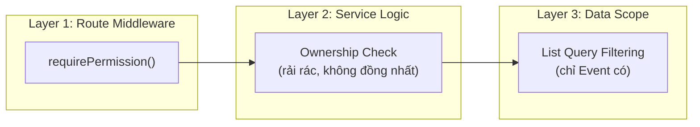
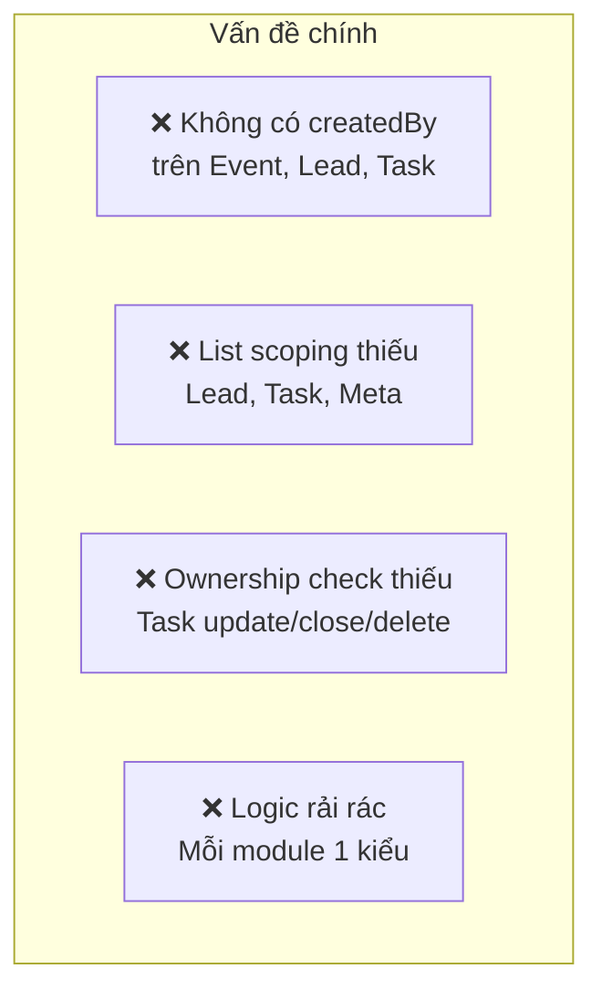
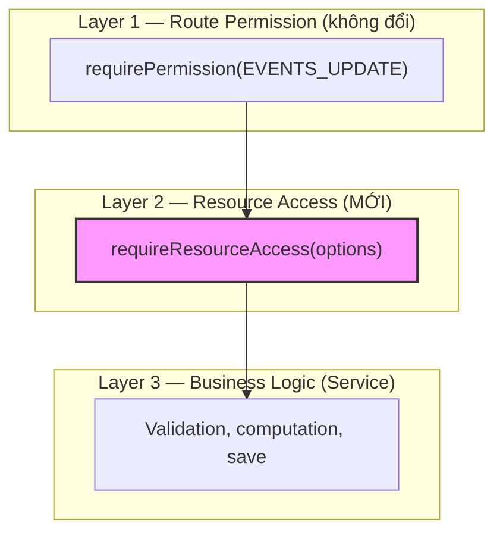

# 🔐 Nâng Cấp RBAC → Resource-Level Access Control (RLAC)

> **Phiên bản:** Draft v1 · **Ngày:** 2026-05-13
> **Mục tiêu:** Tăng cường phân quyền từ **role-level** lên **resource-level** — đảm bảo nhân viên chỉ thao tác được trên tài nguyên mà họ được phân công/tạo ra.

---

## 1. Đánh Giá Hiện Trạng

### 1.1. Hệ thống RBAC hiện tại



Hệ thống hiện tại có **2 lớp phân quyền**:

| Lớp                | Cơ chế                               | Trạng thái                         |
| ------------------ | ------------------------------------ | ---------------------------------- |
| **Route-level**    | `requirePermission(PERMISSIONS.X_Y)` | ✅ Đồng nhất, hoạt động tốt        |
| **Resource-level** | Ownership checks trong Service       | ⚠️ Không đồng nhất giữa các module |

### 1.2. Audit Chi Tiết Từng Module

#### 📅 Event — Đã có ownership check một phần

| Khía cạnh     | Trạng thái                 | Chi tiết                                                   |
| ------------- | -------------------------- | ---------------------------------------------------------- |
| List scoping  | ✅                         | STAFF/MANAGER chỉ thấy event assign cho mình + chưa assign |
| Stats scoping | ✅                         | Đồng bộ với list                                           |
| Update check  | ✅                         | `checkEventOwnership()` — check assignees                  |
| Create        | ❌ Không track `createdBy` | Ai tạo event? Không biết                                   |
| Delete        | ❌ Không check             | Chỉ dựa vào `EVENTS_DELETE` permission (ADMIN+)            |
| Self-assign   | ✅                         | Logic riêng                                                |
| Unassign      | ✅                         | STAFF chỉ bỏ mình, MANAGER bỏ nhân viên dưới               |

> [!WARNING]
> `checkEventOwnership()` có bug: khi không tìm thấy event, nó fallback sang tìm Lead — logic không rõ ràng, có thể gây confusion.

#### 🎯 Lead — Ownership check tốt nhất

| Khía cạnh    | Trạng thái                 | Chi tiết                                                |
| ------------ | -------------------------- | ------------------------------------------------------- |
| List scoping | ❌ **Không có**            | Mọi STAFF đều thấy tất cả leads                         |
| Update check | ✅                         | `_checkOwnership()` — assignee + manager-of-assignee    |
| Assign check | ✅                         | Chỉ MANAGER+ mới reassign                               |
| Stage change | ✅                         | Qua `_checkOwnership()`                                 |
| Delete check | ✅                         | Qua `_checkOwnership()`                                 |
| Discussion   | ✅                         | `_checkDiscussionPermission()` — STAFF phải là assignee |
| Create       | ❌ Không track `createdBy` | Không biết ai tạo                                       |

#### ✅ Task — Ownership check cơ bản

| Khía cạnh            | Trạng thái                 | Chi tiết                                                                   |
| -------------------- | -------------------------- | -------------------------------------------------------------------------- |
| List scoping         | ❌ **Không có**            | Mọi STAFF đều thấy tất cả tasks                                            |
| Update check         | ❌ **Không check**         | Bất kỳ ai có `TASKS_UPDATE` đều sửa được                                   |
| `checkTaskOwnership` | ✅                         | Nhưng chỉ dùng cho **TaskActionChain**, không dùng cho update/delete task! |
| Create               | ❌ Không track `createdBy` |                                                                            |
| Close/Archive        | Partial                    | Archive chỉ ADMIN+, nhưng close không check ownership                      |

> [!CAUTION]
> **Task** là module có lỗ hổng lớn nhất: bất kỳ STAFF nào có `tasks_update` đều sửa/đóng được task của người khác.

#### 📱 Meta Program — Mô hình `picIds` (người phụ trách)

| Khía cạnh             | Trạng thái      | Chi tiết                                         |
| --------------------- | --------------- | ------------------------------------------------ |
| List scoping          | ❌ **Không có** | Mọi STAFF đều thấy tất cả programs               |
| Mutation check        | ✅              | `_checkAccess()` — STAFF phải nằm trong `picIds` |
| Comment delete        | ✅              | Chỉ author hoặc ADMIN+                           |
| Milestone edit/delete | ✅              | Chỉ ADMIN+                                       |
| Create                | Partial         | Không track `createdBy`, nhưng dùng `picIds`     |

### 1.3. Tổng Hợp Lỗ Hổng



---

## 2. Phân Tích Các Phương Án Tiếp Cận

### Phương án A: **Assignee-Based** (chỉ ai được assign mới có quyền)

```
Rule: User có quyền trên resource ↔ user.id ∈ resource.assignees[].userId
```

| Ưu điểm                                     | Nhược điểm                                        |
| ------------------------------------------- | ------------------------------------------------- |
| Phù hợp quy trình CRM: phân công → thao tác | Staff tạo lead nhưng quên assign mình → mất quyền |
| Dễ implement (schema đã có `assignees`)     | Không biết ai tạo ban đầu                         |
| Manager control rõ ràng                     | Phải luôn assign khi tạo                          |

### Phương án B: **Creator-Based** (ai tạo thì có quyền)

```
Rule: User có quyền trên resource ↔ user.id === resource.createdBy
```

| Ưu điểm                       | Nhược điểm                                  |
| ----------------------------- | ------------------------------------------- |
| Rõ ràng: bạn tạo → bạn sở hữu | Không linh hoạt khi chuyển giao             |
| Giống nhiều hệ thống khác     | Manager reassign → người mới không có quyền |
| Dễ audit                      | Không phản ánh workflow CRM                 |

### Phương án C: **Hybrid — Assignee + Creator** ⭐ (Đề xuất)

```
Rule: User có quyền trên resource ↔
      user.id ∈ resource.assignees[].userId
      OR user.id === resource.createdBy
```

| Ưu điểm                          | Nhược điểm                 |
| -------------------------------- | -------------------------- |
| Bao phủ cả 2 trường hợp          | Phức tạp hơn 1 chút        |
| Người tạo luôn có quyền theo dõi | Cần thêm field `createdBy` |
| Assignee linh hoạt reassign      |                            |
| Phù hợp CRM workflow             |                            |

> [!IMPORTANT]
> **Đề xuất chọn Phương án C — Hybrid**. Lý do:
>
> - Trong CRM, nhân viên thường tạo lead/event → tự assign cho mình hoặc được manager assign. Cả 2 case đều cần cover.
> - `createdBy` đóng vai trò "mạng lưới an toàn" — dù bị unassign, creator vẫn xem được resource mình tạo.
> - Manager quản lý thông qua cả `assignees` lẫn `managerId` — linh hoạt nhất.

---

## 3. Kiến Trúc Đề Xuất

### 3.1. Mô hình phân quyền 3 lớp



### 3.2. Middleware mới: `requireResourceAccess`

Tạo **1 middleware duy nhất** thay cho tất cả ownership checks rải rác:

```javascript
// middleware/resourceAccess.js

/**
 * Universal resource-level access check.
 * Chạy SAU requirePermission, TRƯỚC controller.
 *
 * @param {Object} options
 * @param {Function} options.getResource - (req) => Promise<Document> — lấy resource từ DB
 * @param {Function} options.getAssigneeIds - (resource) => string[] — lấy danh sách assignee IDs
 * @param {Function} [options.getCreatorId] - (resource) => string — lấy creator ID
 * @param {string[]} [options.bypassRoles] - Roles được bypass (default: ['OWNER', 'ADMIN'])
 * @param {boolean} [options.allowManager] - Manager có quyền qua assignees' managerId? (default: true)
 * @param {boolean} [options.allowUnassigned] - Cho phép thao tác resource chưa assign? (default: false)
 */
function requireResourceAccess(options) {
  return async (req, res, next) => {
    const user = req.user;
    const role = (user?.roleId || "").toUpperCase();

    // 1. Bypass roles (OWNER, ADMIN mặc định)
    const bypassRoles = options.bypassRoles || ["OWNER", "ADMIN"];
    if (bypassRoles.includes(role)) return next();

    // 2. Lấy resource
    const resource = await options.getResource(req);
    if (!resource) return sendError(res, 404, "Resource not found");

    // 3. Attach resource vào req để controller dùng lại (tránh query lại DB)
    req.resource = resource;

    // 4. Check creator
    if (options.getCreatorId) {
      const creatorId = options.getCreatorId(resource);
      if (creatorId === user.id) return next();
    }

    // 5. Check assignees
    const assigneeIds = options.getAssigneeIds(resource);
    if (assigneeIds.includes(user.id)) return next();

    // 6. Allow unassigned resources
    if (options.allowUnassigned && assigneeIds.length === 0) return next();

    // 7. Manager check — manager của 1 assignee cũng được quyền
    if (options.allowManager && role === "MANAGER") {
      const User = require("../models/User");
      const subordinates = await User.find({ managerId: user.id }).select("id");
      const subIds = subordinates.map((u) => u.id);
      if (assigneeIds.some((id) => subIds.includes(id))) return next();
    }

    return sendError(
      res,
      403,
      "Bạn không có quyền thao tác trên tài nguyên này",
      {
        code: "RESOURCE_ACCESS_DENIED",
      },
    );
  };
}
```

### 3.3. Áp dụng vào Route (ví dụ Event)

```javascript
// routes/v1/events.js — TRƯỚC
router.put(
  "/:id",
  requirePermission(PERMISSIONS.EVENTS_UPDATE),
  EventController.updateEvent,
);

// routes/v1/events.js — SAU
router.put(
  "/:id",
  requirePermission(PERMISSIONS.EVENTS_UPDATE),
  requireResourceAccess({
    getResource: (req) => Event.findOne({ id: req.params.id }),
    getAssigneeIds: (event) => event.assignees.map((a) => a.userId),
    getCreatorId: (event) => event.createdBy,
    allowManager: true,
  }),
  EventController.updateEvent,
);
```

### 3.4. Schema Changes — Thêm `createdBy`

Chỉ cần thêm **1 field** vào mỗi model:

```javascript
// Thêm vào Event, Lead, Task schema:
createdBy: { type: String, ref: "User", default: null, index: true },
```

> [!NOTE]
> `MetaProgram` đã có concept tương tự qua `picIds`. Có thể thêm `createdBy` nhưng access logic vẫn giữ qua `picIds`.

### 3.5. List Scoping — Query Filter thống nhất

Tạo utility function để **tự động filter list queries**:

```javascript
// utils/resourceScope.js

/**
 * Build MongoDB $and clause for resource scoping.
 * @param {Object} currentUser
 * @param {Object} options
 * @param {string} options.assigneeField - path đến assignee userId (default: 'assignees.userId')
 * @param {string} [options.creatorField] - path đến createdBy (default: 'createdBy')
 * @param {boolean} options.includeUnassigned - bao gồm resource chưa assign? (default: true)
 */
async function buildResourceScopeFilter(currentUser, options = {}) {
  const role = (currentUser?.roleId || "").toUpperCase();
  if (["OWNER", "ADMIN"].includes(role)) return {}; // No filter

  const assigneeField = options.assigneeField || "assignees.userId";
  const creatorField = options.creatorField || "createdBy";
  const includeUnassigned = options.includeUnassigned ?? true;

  const allowedUserIds = [currentUser.id];

  // Manager: thêm nhân viên dưới cấp
  if (role === "MANAGER") {
    const User = require("../models/User");
    const subordinates = await User.find({ managerId: currentUser.id }).select(
      "id",
    );
    allowedUserIds.push(...subordinates.map((u) => u.id));
  }

  const orConditions = [
    { [assigneeField]: { $in: allowedUserIds } },
    { [creatorField]: { $in: allowedUserIds } },
  ];

  if (includeUnassigned) {
    orConditions.push({ assignees: { $size: 0 } });
  }

  return { $or: orConditions };
}
```

---

## 4. Ma Trận Quyền Sau Nâng Cấp

### Quy ước ký hiệu:

- ✅ = Có quyền (mọi resource)
- 🔒 = Chỉ resource được assign/tạo
- ❌ = Không có quyền

### 4.1. Event

| Hành động     |               STAFF                |      MANAGER      | ADMIN | OWNER |
| ------------- | :--------------------------------: | :---------------: | :---: | :---: |
| Xem danh sách | 🔒 Assigned + Created + Unassigned | 🔒 + Subordinates |  ✅   |  ✅   |
| Xem chi tiết  |                 🔒                 |     🔒 + Sub      |  ✅   |  ✅   |
| Tạo           |        ✅ (auto createdBy)         |        ✅         |  ✅   |  ✅   |
| Update        |                 🔒                 |     🔒 + Sub      |  ✅   |  ✅   |
| Delete        |                 ❌                 |        ❌         |  ✅   |  ✅   |
| Self-assign   |                 ✅                 |        ✅         |  ✅   |  ✅   |

### 4.2. Lead

| Hành động     |               STAFF                |      MANAGER      | ADMIN | OWNER |
| ------------- | :--------------------------------: | :---------------: | :---: | :---: |
| Xem danh sách | 🔒 Assigned + Created + Unassigned |     🔒 + Sub      |  ✅   |  ✅   |
| Xem chi tiết  |                 🔒                 |     🔒 + Sub      |  ✅   |  ✅   |
| Tạo           |        ✅ (auto createdBy)         |        ✅         |  ✅   |  ✅   |
| Update        |                 🔒                 |     🔒 + Sub      |  ✅   |  ✅   |
| Assign        |                 ❌                 | ✅ (subordinates) |  ✅   |  ✅   |
| Delete        |                 ❌                 |     🔒 + Sub      |  ✅   |  ✅   |
| Discussion    |                 🔒                 |        ✅         |  ✅   |  ✅   |

### 4.3. Task

| Hành động     |         STAFF         | MANAGER  | ADMIN | OWNER |
| ------------- | :-------------------: | :------: | :---: | :---: |
| Xem danh sách | 🔒 Assigned + Created | 🔒 + Sub |  ✅   |  ✅   |
| Tạo           |  ✅ (auto createdBy)  |    ✅    |  ✅   |  ✅   |
| Update        |          🔒           | 🔒 + Sub |  ✅   |  ✅   |
| Close         |          🔒           | 🔒 + Sub |  ✅   |  ✅   |
| Archive       |          ❌           |    ❌    |  ✅   |  ✅   |
| Delete        |          ❌           | 🔒 + Sub |  ✅   |  ✅   |

### 4.4. Meta Program

| Hành động      |       STAFF       |   MANAGER    | ADMIN | OWNER |
| -------------- | :---------------: | :----------: | :---: | :---: |
| Xem danh sách  |      🔒 PIC       |   🔒 + Sub   |  ✅   |  ✅   |
| Tạo            |   ✅ (auto PIC)   |      ✅      |  ✅   |  ✅   |
| Update         |      🔒 PIC       | 🔒 + Sub PIC |  ✅   |  ✅   |
| Delete         |        ❌         |    🔒 PIC    |  ✅   |  ✅   |
| Milestone CRUD | 🔒 PIC (add only) |    🔒 PIC    |  ✅   |  ✅   |

---

## 5. Implementation Plan

### Phase 1: Schema + Utility (Nền tảng)

> Ưu tiên: **Cao** · Ước lượng: ~1 session · Risk: **Thấp**

| #   | Task                                                           | Files                                                 |
| --- | -------------------------------------------------------------- | ----------------------------------------------------- |
| 1.1 | Thêm `createdBy` field vào Event, Lead, Task schema            | `models/Event.js`, `models/Lead.js`, `models/Task.js` |
| 1.2 | Tạo `utils/resourceScope.js` — `buildResourceScopeFilter()`    | `utils/resourceScope.js` (mới)                        |
| 1.3 | Tạo `middleware/resourceAccess.js` — `requireResourceAccess()` | `middleware/resourceAccess.js` (mới)                  |
| 1.4 | Set `createdBy = currentUser.id` trong create methods          | `EventService`, `LeadService`, `TaskService`          |

### Phase 2: Chuẩn hóa Ownership (Refactor)

> Ưu tiên: **Cao** · Ước lượng: ~2 sessions · Risk: **Trung bình**

| #   | Task                                                                                   | Files                                                                                                        |
| --- | -------------------------------------------------------------------------------------- | ------------------------------------------------------------------------------------------------------------ |
| 2.1 | **Event**: Xóa `checkEventOwnership()` → dùng `requireResourceAccess` middleware       | `EventService`, `EventController`, `EventActionChainController`, `routes/events.js`, `routes/eventChains.js` |
| 2.2 | **Lead**: Thay `_checkOwnership()` / `_checkDiscussionPermission()` → dùng middleware  | `LeadService`, `routes/leads.js`                                                                             |
| 2.3 | **Task**: Thêm ownership check cho update/close/delete (hiện thiếu!) → dùng middleware | `TaskService`, `TaskController`, `routes/tasks.js`                                                           |
| 2.4 | **Meta**: Giữ `_checkAccess()` hiện tại nhưng thêm Manager subordinate check           | `MetaService`                                                                                                |
| 2.5 | Fix bug `checkEventOwnership` fallback sang Lead                                       | `EventService`                                                                                               |

### Phase 3: List Scoping (Data Visibility)

> Ưu tiên: **Trung bình** · Ước lượng: ~1 session · Risk: **Trung bình**

| #   | Task                                                                  | Files          |
| --- | --------------------------------------------------------------------- | -------------- |
| 3.1 | **Lead** `getLeads()`: Áp dụng `buildResourceScopeFilter`             | `LeadService`  |
| 3.2 | **Lead** `getStageCounts()`: Đồng bộ scope filter                     | `LeadService`  |
| 3.3 | **Task** `getTasks()`: Áp dụng scope filter                           | `TaskService`  |
| 3.4 | **Meta** `getPrograms()`: Áp dụng scope filter (picIds)               | `MetaService`  |
| 3.5 | **Event** `getEvents()`: Cập nhật dùng utility chung thay logic riêng | `EventService` |

### Phase 4: Data Migration + Testing

> Ưu tiên: **Trung bình** · Ước lượng: ~1 session · Risk: **Thấp**

| #   | Task                                                                                                                                       | Files                               |
| --- | ------------------------------------------------------------------------------------------------------------------------------------------ | ----------------------------------- |
| 4.1 | Migration script: backfill `createdBy` cho existing records (dùng `activityLogs[0].performedBy` cho Lead, timeline[0].createdBy cho Event) | `scripts/migrateCreatedBy.js` (mới) |
| 4.2 | Cập nhật RBAC documentation                                                                                                                | `docs/rbac_document.md`             |
| 4.3 | Test cases cho từng role × resource × action                                                                                               | Manual/Integration test             |

---

## 6. Nguyên Tắc Thiết Kế

> [!TIP]
>
> ### Quy tắc vàng
>
> 1. **OWNER/ADMIN luôn bypass** — không bao giờ bị chặn bởi resource-level check
> 2. **MANAGER = subordinates' scope** — thấy/sửa resource của nhân viên dưới cấp
> 3. **STAFF = own scope** — chỉ thấy/sửa resource mình tạo hoặc được assign
> 4. **Creator = safety net** — dù bị unassign, creator vẫn giữ quyền xem
> 5. **Unassigned = visible** — resource chưa assign hiển thị cho tất cả (để ai đó nhận)

> [!IMPORTANT]
>
> ### Không phá vỡ tính năng hiện tại
>
> - Route-level permissions (`requirePermission`) giữ nguyên 100%
> - Resource-level check thêm **SAU** route permission, không thay thế
> - Rollback dễ dàng: chỉ cần bỏ middleware khỏi route

---

## 7. Câu Hỏi Cần Xác Nhận

1. **Staff có nên thấy tất cả Lead/Task/Event trong danh sách không?**
   - **Option A**: Chỉ thấy assigned/created (bảo mật cao)
   - **Option B**: Thấy tất cả nhưng chỉ sửa được assigned/created (bảo mật vừa, UX tốt hơn)
2. **Manager có được tự assign mình vào resource của subordinate không?**
   - Hiện tại: Manager bypass ownership check → có
3. **Khi unassign tất cả người phụ trách, resource có nên hiển thị cho mọi STAFF không?**
   - Đề xuất: Có (để ai đó nhận lại)

4. **Bạn muốn triển khai ngay Phase 1+2 (core) hay cần review thêm?**
